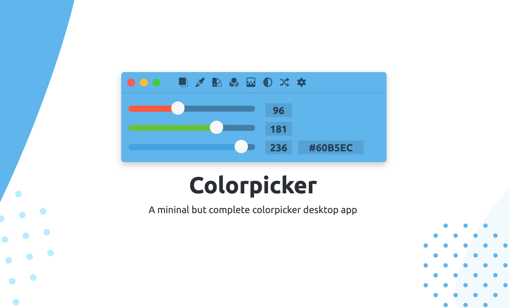
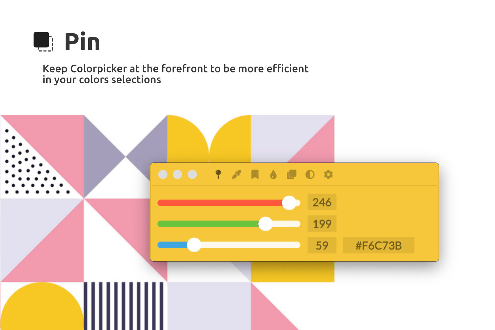
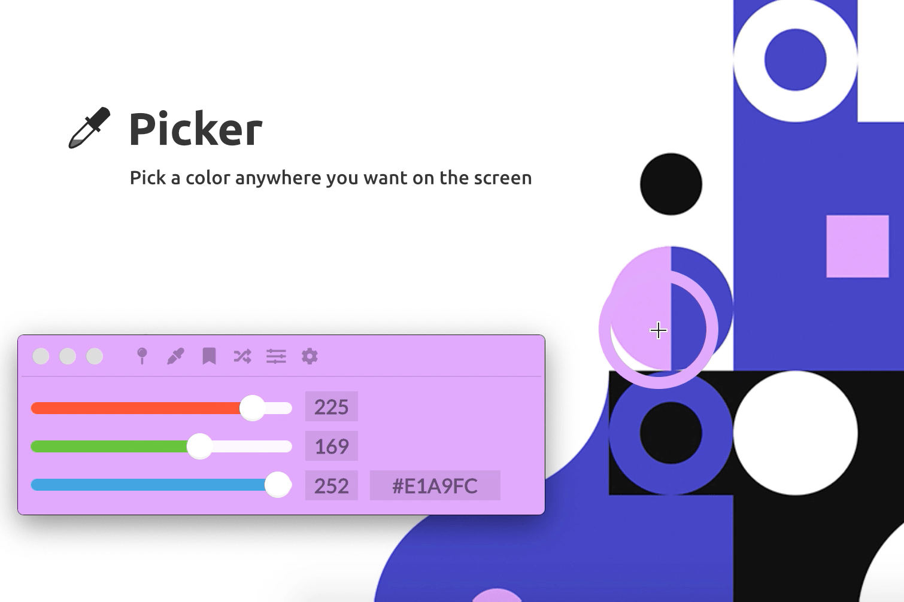
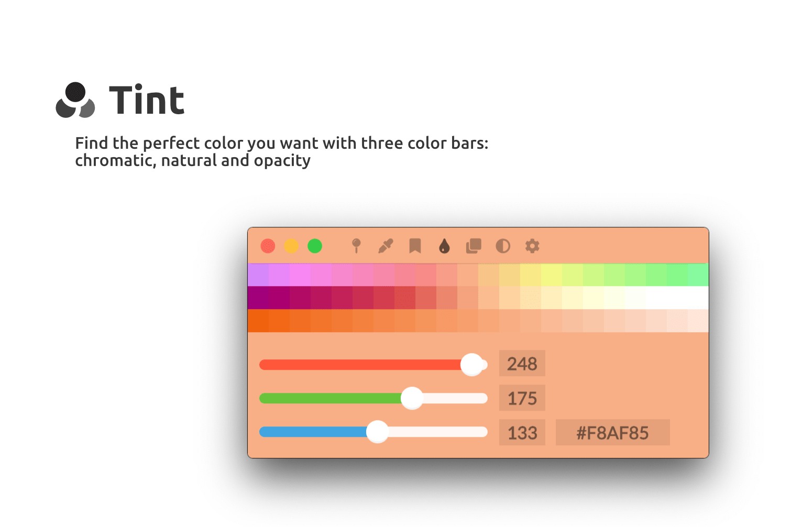
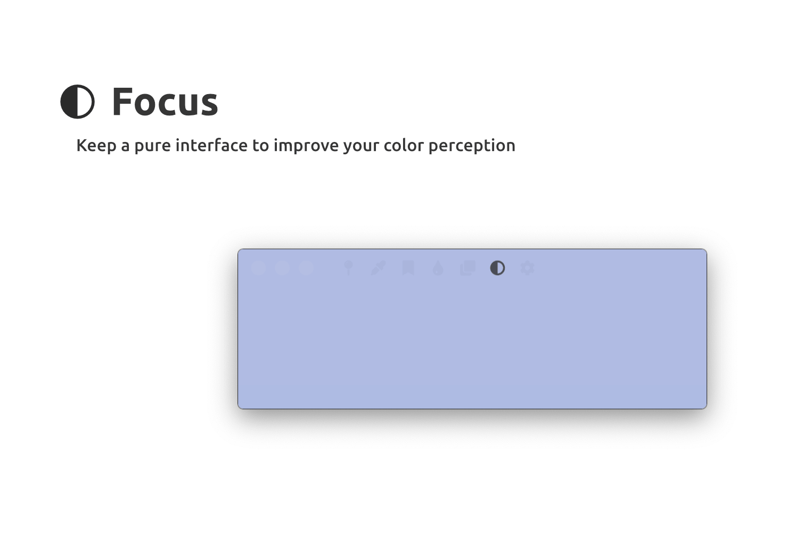
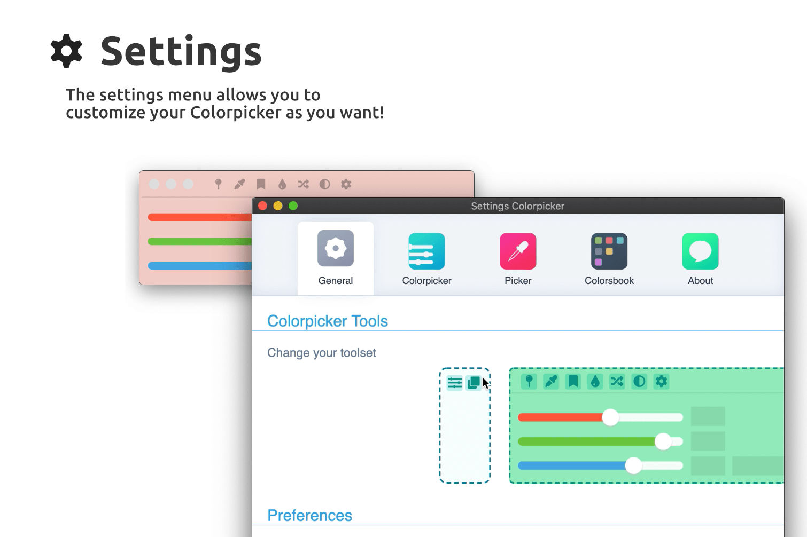

<p align="center">
    <a href="https://colorpicker.fr">
        
    </a>
    <h1 align="center">Colorpicker</h1>
    <p align="center">Modern and powerful color management software</p>
    <p align="center">
        
    
    
    
    
    <a href="https://snapcraft.io/colorpicker-app">
      
    </a>
    <a href="https://crowdin.com/project/colorpicker">
      
    </a>
    </p>
</p>

---

<h4 align="center">
  Want to help with the localization of Colorpicker?
</h4>
<p align="center">
  Please connect to <a href="https://crowdin.com/project/colorpicker" target="_blank">Crowdin and join the project</a>, your contribution is highly appreciated! 👍
</p>

---

Colorpicker is a desktop tool with _Electron_ to get and save colors code quickly for _OSX_, _Windows_ and _Linux_!

<p align="center">
    
</p>

Colorpicker's menu come with a lot of cool features :

- [Pin](#pin): pin Colorpicker to the foreground;
- [Picker](#picker): open an eyedropper who can pick a color from your desktop;
- [Colorsbook](#colorsbook): open Colorsbook, a color manager;
- [Shading](#shading): show three bar of shading — hue bar, natural bar and lightness bar;
- [Clean Vue](#clean-vue): unshow menu, ranges and inputs;
- [Magic color](#magic-color): show colors from the clipboard;
- [Random](#random): show a random color;
- [Settings](#settings): open the preferences panel.

## Pin



With Pin, you can bring Colorpicker to the foreground. This makes it convenient to work quickly with different
applications at the same time.

---

## Picker



The Picker allows you to quickly retrieve a color anywhere on the screen. Whether it's on your browser, Photoshop, or
whatever.

---

## Colorsbook


Colorsbook is a full-fledged application. It allows you to store your colors, categorize them, and easily retrieve them.
It is destined to mature over time.
**Cool tip:** you can save color from colorpicker with `CMD+S` or `CTRL+S`!

---

## Shading



With the shades, you can find the perfect color you need. You have a chromatic bar, a natural color bar and a shadow
bar.

---

## Focus Mode



Need to compare a color or clean up the interface? This feature is for you, this will hide the sliders and make the menu
more transparent.

---

## Magic Color [WIP]

This functionality is still under development. Currently, it allows you to display the first color that is in your
clipboard. This works with hexadecimal and RGB codes

---

## Random

A traditional feature, it allows you to display a color randomly.

---

## Settings



The settings menu allows you to customize your Colorpicker, I let you discover it yourself :)!

# Download

- You can download [on GitHub releases here.](https://github.com/Toinane/colorpicker/releases)

## Want to support me?

You can [buy me a coffee here](https://toinane.itch.io/colorpicker)! Thank you!

#### **_Happy Design !_**

# Development

### Prerequisites

#### Windows

You'll need to install Visual Studio Installer and install Development with C++ module.

Install latest Python version.

#### MacOS

You'll need the latest Xcode Command Line Tools installed.

Install latest Python version.

#### Linux

Install libxtst-dev libpng++-dev package:
`apt-get install libxtst-dev libpng++-dev`

Install latest Python version if already installed.

### How to compile

1. Install dependencies:

```shell
npm install
```

2. Rebuild C/C++ modules to the correct Electron version:

```shell
npm run rebuild
```

3. Launch Colorpicker in development mode:

```shell
npm start
```

4. To build a new version:

```shell
npm run release
```
