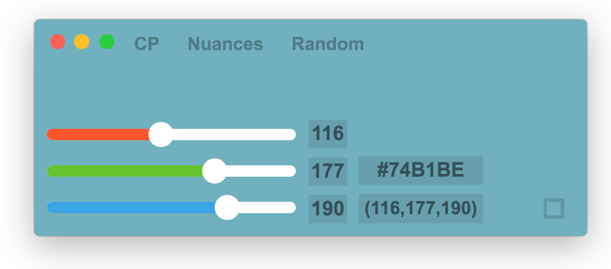
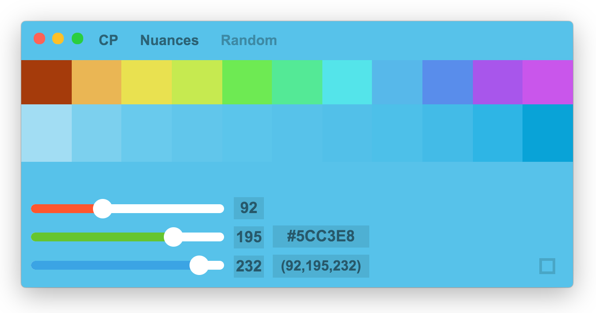
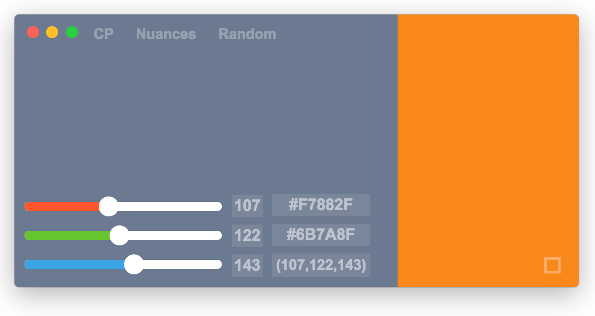

  

# Colorpicker

Colorpicker is a little Electron app that can show colors with hex/rgb code, and generate shading for your color.

Colorpicker's menu come with three cool features :

- CP: it make colopicker always on top of other windows.
- Shading: open panel with shading options.
- Random: show random color.

## Shading

You can click on colors to get it own hex/rgb code.

## Comparison

The little square on the bottom right allow you to show second color to compare.
A new input is visible to change the second color.

# Installation

- For macOS / Windows : you can download [latest build here.](https://github.com/Toinane/colorpicker/releases)
- For Linux : In future update.. :)

#### **Happy Design !**

### Developer

- To build robotjs :
  > npm rebuild --runtime=electron --target=1.6.11 --disturl=https://atom.io/download/atom-shell --abi=57
  > or use npm run rebuild
